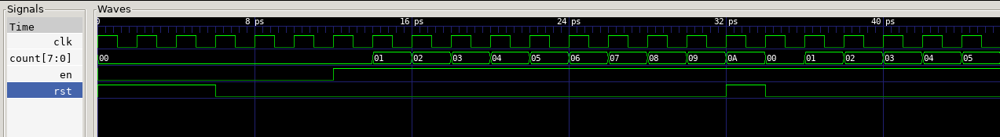
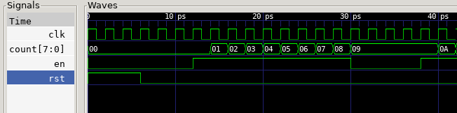

# Task 1: Simulating a basic 8-bit binary counter

We are first asked to create a new System Verilog file `counter.sv` and populate it with the code below:

```SystemVerilog
module counter #(
    parameter WIDTH = 8
)(
    // interface signals
    input   logic               clk,    // clock
    input   logic               rst,    // reset
    input   logic               en,     // counter enable
    output  logic   [WIDTH-1:0] count   // count output
);

always_ff @ (posedge clk)
    if (rst) count <= {WIDTH{1'b0}};
    else     count <= count + {{WIDTH-1{1'b0}}, en};
    // else statement counts upwards by concating a WIDTH - 1 of 0 bits to en
    // ie append 00000001 or 00000000 based on whether enable is HIGH
endmodule
```

The module created is a simple 8-bit binary counter that increments by 1 on each rising clock edge when `en` is high. This is done by cleverly concatenating a string of 0 bits of length `WIDTH-1`, in this case 7, to the enable bit.

It also **synchronously** resets to 0 when `rst` is asserted. Note that it is synchronous because `rst` is not added to the `always_ff` sensitivity list. If it was to be asynchronous, the logic would be changed to:
```SystemVerilog
always_ff @ (posedge clk, posedge rst)
```

A testbench file `counter_tb.cpp` is then added for us to interact with the module:
```C++
#include "Vcounter.h"
#include "verilated.h"
#include "verilated_vcd_c.h"

int main(int argc, char **argv, char **env) {
    int i;
    int clk;

    Verilated::commandArgs(argc, argv);
    // init top verilog instance
    Vcounter* top = new Vcounter;
    // init trace dump
    Verilated::traceEverOn(true);
    VerilatedVcdC* tfp = new VerilatedVcdC;
    top->trace (tfp, 99);
    tfp->open ("counter.vcd");

    // initialize simulation inputs
    top->clk = 1;
    top->rst = 1;
    top->en = 0;

    // run simulation for many clock cycles
    for (i=0; i<300; i++) {

        // dump variables into VCD file and toggle clock
        for (clk=0; clk<2; clk++) {
            tfp->dump (2*i+clk);
            top->clk = !top->clk;
            top->eval ();
        }
        top->rst = (i < 2) | (i == 15);
        top->en = (i > 4);
        if (Verilated::gotFinish()) exit(0);
    }
    tfp->close();
    exit(0);
}
```

The testbench annotations can be found in the lab brief for more detail about the testbench. The script essentially simulates clock cycles for the module, where it dumps the signal trace from the module into `counter.vcd` for us to analyse in GTKWave.

Additionally, we note that the program sets `rst` to HIGH on clock cycles 0 to 1 and at clock cycle 15. `en` is set to high after clock cycle 4.

```C++
top->rst = (i < 2) | (i == 15);
top->en = (i > 4);
```

With this in mind, we can analyse run the `verilator` command and `make` the `.mk` file to generate `counter.vcd` for us to analyse in GTKWave:


The wave file is as expected, where we observe that the `clk` variable toggles to HIGH every other frame, simulating a `clk` pulse. Further, the `rst` and `en` outputs are as expected, where we see a HIGH value for `rst` from clock cycle 0 to 2 and at cycle 16 (one cycle after it is toggled HIGH on cycle 15). Similarly. we see that `en` outputs HIGH on clock cycle 6, one cycle after it is set to HIGH on cycle 5.

As a result, `count` only begins counting on cycle 7 (one cycle after en outputs HIGH), and it increments by one bit every cycle, before being reset on cycle 17 after the `rst` HIGH on cycle 16.

We note that the time axis is set in ps which is incredibly fast, even for a modern computer. This is due to the way that the signal trace is generated from the testbench, where it is not accurate to look at the time for the clock cycle simulation generated.

To avoid retyping all the commands, we also create a `doit.sh` shell script:
```bash
#!/bin/sh

# cleanup
rm -rf obj_dir
rm -f counter.vcd

# run Verilator to translate Verilog into C++, including C++ testbench
verilator -Wall -cc --trace counter.sv --exe counter_tb.cpp

# build C++ project via make automatically generated by Verilator
make -j -C obj_dir/ -f Vcounter.mk Vcounter

# run executable simulation file
obj_dir/Vcounter
```

This allows us to conveniently run all the commands in one go.

### Test Yourself Challenges

We are asked to modify the tesbench to stop counting for 3 cycles once the counter reaches 0x9 and then resume counting.

To do this:
1. We add an if statement to check when `top->count == 9`.
2. We then set `en` to LOW when this happens and add an integer variable `j` to count 3 cycles.
3. Once the 3 cycles are up, we set `en` back to HIGH and continue counting as usual.
4. We also remove the rst clause for `top->rst = (i == 15)`, because this interferes with the counter at value 9.

The changes are annotated with 3 slashes in the code.

```C++
#include "Vcounter.h"
#include "verilated.h"
#include "verilated_vcd_c.h"

int main(int argc, char **argv, char **env) {
    int i;
    int clk;
    int j = 0; /// add integer variable j to count the 3 cycles

    Verilated::commandArgs(argc, argv);
    // init top verilog instance
    Vcounter* top = new Vcounter;
    // init trace dump
    Verilated::traceEverOn(true);
    VerilatedVcdC* tfp = new VerilatedVcdC;
    top->trace (tfp, 99);
    tfp->open ("counter.vcd");

    // initialize simulation inputs
    top->clk = 1;
    top->rst = 1;
    top->en = 0;

    // run simulation for many clock cycles
    for (i=0; i<300; i++) {

        // dump variables into VCD file and toggle clock
        for (clk=0; clk<2; clk++) {
            tfp->dump (2*i+clk);
            top->clk = !top->clk;
            top->eval ();
        }
        top->rst = (i < 2); /// remove condition for (i == 15)
        top->en = (i > 4);

        /// add an if statement to check if count == 9
        if (top->count == 9) {
            if (j <= 3) {
                j += 1;
                top->en = 0;
            }
            else j = 0;
        }

        if (Verilated::gotFinish()) exit(0);
    }
    tfp->close();
    exit(0);
}
```

After compiling and running the code, we observe the GTKWave output below:


As observed in the waveform, we pause the counting for 3 clock cycles when count == 0x9 and resume counting afterwards.

Our next challenge is to implement asynchronous reset. As discussed prior, we can add `rst` to the sensitivity list to achieve this:
```SystemVerilog
always_ff @ (posedge clk, posedge rst)
```