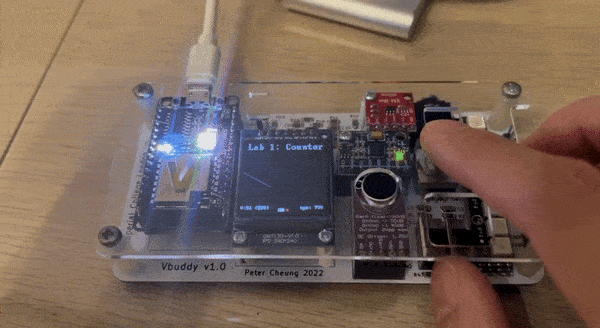

# Task 2: Linking Verilator simulation with Vbuddy

In this task, we follow the instructions provided to connect Vbuddy to our computer.

After Vbuddy has successfully connected to our device, we modify our testbench to include code that interacts with Vbuddy:

```C++
#include "Vcounter.h"
#include "verilated.h"
#include "verilated_vcd_c.h"
#include "vbuddy.cpp"

int main(int argc, char **argv, char **env) {
    int i;
    int clk;

    Verilated::commandArgs(argc, argv);
    // init top verilog instance
    Vcounter* top = new Vcounter;
    // init trace dump
    Verilated::traceEverOn(true);
    VerilatedVcdC* tfp = new VerilatedVcdC;
    top->trace (tfp, 99);
    tfp->open ("counter.vcd");

    //init Vbuddy
    if (vbdOpen()!=1) return(-1);
    vbdHeader("Lab 1: Counter");

    // initialize simulation inputs
    top->clk = 1;
    top->rst = 1;
    top->en = 0;

    // run simulation for many clock cycles
    for (i=0; i<300; i++) {

        // dump variables into VCD file and toggle clock
        for (clk=0; clk<2; clk++) {
            tfp->dump (2*i+clk);
            top->clk = !top->clk;
            top->eval ();
        }
        
        // ++++ Send count value to Vbuddy
        vbdHex(4, (int(top->count) >> 16) & 0xF);
        vbdHex(3, (int(top->count) >> 8) & 0xF);
        vbdHex(2, (int(top->count) >> 4) & 0xF);
        vbdHex(1, int(top->count) & 0xF);
        vbdCycle(i+1);
        // ---- end of Vbuddy output section

        // change input stimuli
        top->rst = (i < 2) | (i == 15);
        top->en = (i > 4);
        if (Verilated::gotFinish()) exit(0);
    }

    vbdClose();
    tfp->close();
    exit(0);
}
```

A more detailed annotation of the changes can be found in the lab instruction. However, we essentially include a new header provided by the lab:
```C++
#include "vbuddy.cpp"
```

We also open and initialize Vbuddy with:
```c++
//init Vbuddy
if (vbdOpen()!=1) return(-1);
vbdHeader("Lab 1: Counter");
```

Finally, we add code to output the count value to a 7-seg display every cycle:
```C++
// ++++ Send count value to Vbuddy
vbdHex(4, (int(top->count) >> 16) & 0xF);
vbdHex(3, (int(top->count) >> 8) & 0xF);
vbdHex(2, (int(top->count) >> 4) & 0xF);
vbdHex(1, int(top->count) & 0xF);
vbdCycle(i+1);
// ---- end of Vbuddy output section
```

This block essentially initialises 4 7-seg displays, where the count value is bit shifted by 4 bits to each display to dispaly each hex value. A `0xF` mask is also applied to ensure it fits the expected 8 bit format.

At the end of the file, we also add `vbdClose();` to close Vbuddy.

After compiling and running the code, we can observe the counting on the Vbuddy screen:


We are also told to explore the Vbuddy flag feature. The flag value can be toggled HIGH and LOW using the rotary ecnoder's push-button switch. To visualise this, we set the counter's `en` input to Vbuddy's flag value:
```C++
top->en = vbdFlag(); // replaces top->en = (i > 4);
```

We can then visualise the toggling of the counter `en` with Vbuddy:


Finally, we are told to try plotting the counter value with `vbdPlot()` instead of using the 7-segment display. This is done by replacing the `vbdHex()` block with:
```C++
vbdPlot(int(top->count), 0, 255);
```

We also increase the number of clock cycles from 300 to 1000, as plotting dots on the screen is much faster than animating the 7-segment display.


As expected, we observe a linear relationship between clock cycles and count value. When we toggle `en` to LOW, we see the plot adjusting to a horizontal line, as the count is no longer increasing.

### Test Yourself Challenge

For the challenge, we are told to modify the counter and testbench files so that the `en` signal controls the direction of counting via the `vbdFlag()`.

This can be done by modifying the behaviour of `en` in counter.sv:

```SystemVerilog
always_ff @ (posedge clk)
    if (rst)         count <= {WIDTH{1'b0}};
    else if (en)     count <= count + {{WIDTH-1{1'b0}}, 1};
    else             count <= count - {{WIDTH-1{1'b0}}, 1};
```

This way, `en` at LOW would cause the counter to count down, and `en` at HIGH would cause the counter to count up:

