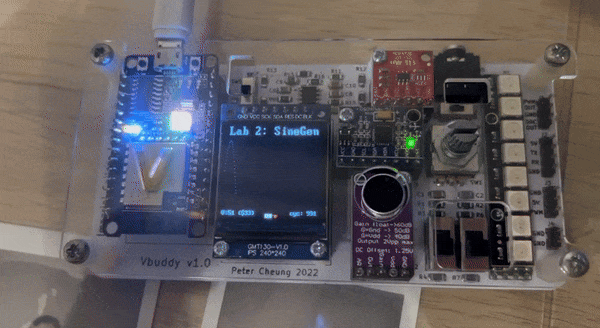
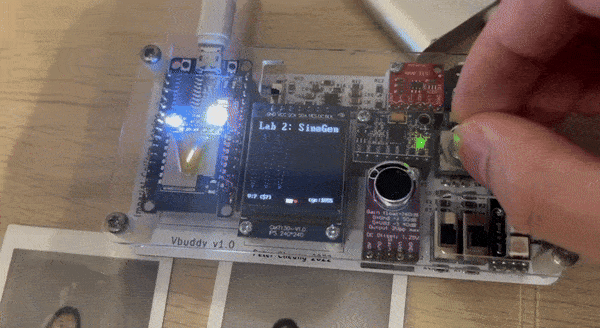

# Task 1: Simple sinewave generator

We are first instructed to build a 256 X 8 rom module. This module can be found in the lecture slides:

```SystemVerilog
module rom #(
    parameter    ADDRESS_WIDTH = 8,
                DATA_WIDTH = 8
)(
    input logic                             clk,
    input logic     [ADDRESS_WIDTH-1:0]     addr,
    output logic    [DATA_WIDTH-1:0]        dout
);

logic   [DATA_WIDTH-1:0] rom_array [2**ADDRESS_WIDTH-1:0];
// we declare a rom_array that can store 2**ADDRESS_WIDTH addresses.

initial begin
        $display("Loading rom.");
        $readmemh("sinerom.mem", rom_array);
end;

always_ff @(posedge clk)
    dout <= rom_array [addr];

endmodule
```

This is a parameterised rom, where the `ADDRESS_WIDTH` and `DATA_WIDTH` can be specified. This is a simple rom module that takes an `address` (of length `ADDRESS_WIDTH`) to output the stored data (of length `DATA_WIDTH`) at that address to `dout` on the next clock cycle.

In our case, since we want to build a 256 X 8 rom, we need an `ADDRESS_WIDTH` of 8 (2 ** 8 = 256) and `DATA_WIDTH` of 8.

We are also instructed to examine the files `sinegen.py` and `sinerom.mem`:

```python
import math
import string
f = open("sinerom.mem","w")
for i in range(256):
    v = int(math.cos(2*3.1416*i/256)*127+127)
    if (i+1)%16 == 0:
        s = "{hex:2X}\n"
    else:
        s = "{hex:2X} "
    f.write(s.format(hex=v))

f.close()
```

Since we are writing onto a rom with 256 addresses, we plot 256 points of a cosine wave. 

```python
v = int(math.cos(2*3.1416*i/256)*127+127)
```

The cosine wave has a period of 256 steps, such that the rom will contain points pertaining to one full cycle of a cosine wave. 

The cosine wave also has an amplitude of 127, and the wave is offset upwards along the y-axis by 127 to ensure that there are no negative y values in the wave and the wave can be plotted as unsigned. Recall that we are storing 8-bit data in the rom, so the maximum unsigned integer possible is 255. By setting the amplitude to 127 and translating it upwards by 127, we are able to represent the entire cosine wave between 0 and 255.

 Finally, the generated y-value at each point is converted to integer such that it can be written as an 8 bit unsigned integer string in the rom.

```python
    if (i+1)%16 == 0:
        s = "{hex:2X}\n"
    else:
        s = "{hex:2X} "
```

We note that the script also concatenates a newline to every 16th value. This to nicely format the rom into a 16 x 16 square:

```
FE FD FD FD FD FD FC FC FB FA FA F9 F8 F7 F6 F5
F4 F3 F1 F0 EF ED EB EA E8 E6 E5 E3 E1 DF DD DA
D8 D6 D4 D1 CF CD CA C8 C5 C2 C0 BD BA B8 B5 B2
AF AC A9 A6 A3 A0 9D 9A 97 94 91 8E 8B 88 85 82
7E 7B 78 75 72 6F 6C 69 66 63 60 5D 5A 57 54 51
4E 4B 48 45 43 40 3D 3B 38 35 33 30 2E 2C 29 27
25 23 20 1E 1C 1A 18 17 15 13 12 10  E  D  C  A
 9  8  7  6  5  4  3  3  2  1  1  0  0  0  0  0
 0  0  0  0  0  0  1  1  2  3  3  4  5  6  7  8
 9  A  C  D  E 10 12 13 15 17 18 1A 1C 1E 20 23
25 27 29 2C 2E 30 33 35 38 3B 3D 40 43 45 48 4B
4E 51 54 57 5A 5D 60 63 66 69 6C 6F 72 75 78 7B
7F 82 85 88 8B 8E 91 94 97 9A 9D A0 A3 A6 A9 AC
AF B2 B5 B8 BA BD C0 C2 C5 C8 CA CD CF D1 D4 D6
D8 DA DD DF E1 E3 E5 E6 E8 EA EB ED EF F0 F1 F3
F4 F5 F6 F7 F8 F9 FA FA FB FC FC FD FD FD FD FD
```

We observe that the generated rom is as expected, where we achieve a peak value of FE (254) at the start to a low value of 0 in the middle of the rom, then back to FD (253) at the end. This sinusoidal pattern matches how a consine wave behaves.

Next, we create a "top-level" module called `sinegen.sv` to include the `counter.sv` from the last lab and our new `rom.sv` to create a sinewave generator.


This module uses the counter to walk through the different addresses stored in the rom sequentially, where the values stored in the rom would be plotted, to generate the sinewave on Vbuddy. We also include a `incr` input to our `counter.sv` which dictates the step increment for the counter. ie an `incr` of 2 would skip every other value in the rom. This way, we are able to visually change the frequency of the cosine wave generated on Vbuddy. This is implemented by removing the line:
```SystemVerilog
else     count <= count + {{WIDTH-1{1'b0}}, en};
```

and instead adding the `incr` directly to the `count` (since the `incr` input is already formatted as 8 bits):

```SystemVerilog
else if (en)     count <= count + incr;
```

This creates a counter module as seen below:


```SystemVerilog
module counter #(
    parameter WIDTH = 8
)(
    // interface signals
    input   logic               clk,    // clock
    input   logic               rst,    // reset
    input   logic               en,     // counter enable
    input   [WIDTH-1:0]         incr,   // step
    output  logic   [WIDTH-1:0] count   // count output
);

always_ff @ (posedge clk)
    if (rst) count <= {WIDTH{1'b0}};
    else if (en)     count <= count + incr;
    // else statement counts upwards by concating a WIDTH - 1 of 0 bits to en
    // ie append 00000001 or 00000000 based on whether enable is HIGH
endmodule
```

Once the `counter.sv` and `rom.sv` files are ready, we can combine them in `sinegen.sv` by assigning the `count` output from counter to the `addr` input of the rom as seen below:

```SystemVerilog
module sinegen #(
        parameter   A_WIDTH = 8,
                    D_WIDTH = 8
)(
    input   logic                   clk,
    input   logic                   rst,
    input   logic                   en,
    input   logic   [D_WIDTH-1:0]   incr,
    output  logic   [D_WIDTH-1:0]   dout
);

    logic   [A_WIDTH-1:0]           address;

counter addrCounter(
    .clk (clk),
    .rst (rst),
    .en (en),
    .incr (incr),
    .count (address) // assign the count output to address input
);

rom sineRom (
    .clk (clk),
    .addr (address),
    .dout (dout)
);

endmodule
```

We then create a testbench for sinegen:

```C++
#include "Vsinegen.h"
#include "verilated.h"
#include "verilated_vcd_c.h"
#include "vbuddy.cpp"

int main(int argc, char **argv, char **env) {
    int i;
    int clk;

    Verilated::commandArgs(argc, argv);
    // init top verilog instance
    Vsinegen* top = new Vsinegen;
    // init trace dump
    Verilated::traceEverOn(true);
    VerilatedVcdC* tfp = new VerilatedVcdC;
    top->trace (tfp, 99);
    tfp->open ("sinegen.vcd");

    //init Vbuddy
    if (vbdOpen()!=1) return(-1);
    vbdHeader("Lab 2: SineGen");

    // initialize simulation inputs
    top->clk = 1;
    top->rst = 0;
    top->en = 1;
    top->incr = 5;

    // run simulation for many clock cycles
    for (i=0; i<1000000; i++) {

        // dump variables into VCD file and toggle clock
        for (clk=0; clk<2; clk++) {
            tfp->dump (2*i+clk);
            top->clk = !top->clk;
            top->eval ();
        }
        
        // ++++ Send dout value to Vbuddy
        vbdPlot((int) (top->dout), 0, 255);
        vbdCycle(i);
        // ---- end of Vbuddy output section

        if ((Verilated::gotFinish()) || (vbdGetkey()=='q'))
            exit(0);
    }

    vbdClose();
    tfp->close();
    exit(0);
}
```

This testbench is very similar to the last lab, except for the following changes:
1. To visualise the cosine wave on Vbuddy, we plot the output values from the rom using `vbdPlot((int) (top->dout), 0, 255);`.
2. We extend the clock cycle limit to 1 million, as we are generating a contiuous sinewave that will run through the cycles very quickly (plot is an inexpensive operation)
3. We add the ability to terminate the program with our 'q' key by adding `vbdGetkey() = 'q'`. This way, we can more elegantly exit the simulation (since we now have so many clock cycles).
4. For this experiment, we set the `incr` to 5 so that we can observe a higher frequency of the wave.

After compiling the program, we run it to see the result:



### Test Yourself Challenges

We are challenged to use `vbdValue` to change the frequency of the sinewave generated. As discussed prior, this can be done by changing the `incr` value. We just need to connect the `incr` input to vbdValue. We move `incr` value assignment to within the for loop (so that it updates each cycle) and assign its value as such:

```C++
top->incr = vbdValue();
```

Compiling and running the program:



