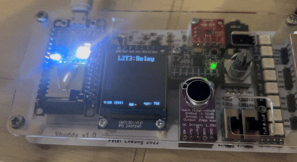

# Task 3: Capture and display audio signal in RAM

The final task for this lab is to capture real audio signals using the microphone module on Vbuddy and plot them out.

The samples are written to a dual-port RAM, where at one instance, we are writing to the RAM signal, and reading from a previous RAM address written a fixed offset ago. This way, we are essentially plotting a delayed version of the original signal.

We first implement a dual-port RAM using the notes from our lecture:

```SystemVerilog
module ram2ports #(
    parameter    ADDRESS_WIDTH = 8,
                DATA_WIDTH = 8
)(
    input logic                             clk,
    input logic                             wr_en,
    input logic                             rd_en,
    input logic     [ADDRESS_WIDTH-1:0]     wr_addr,
    input logic     [ADDRESS_WIDTH-1:0]     rd_addr,
    input logic     [DATA_WIDTH-1:0]        din,
    output logic    [DATA_WIDTH-1:0]        dout
);

logic   [DATA_WIDTH-1:0] ram_array  [2**ADDRESS_WIDTH-1:0];

always_ff @(posedge clk)
begin
    if (wr_en == 1'b1)
        ram_array[wr_addr] <= din;
    if (rd_en == 1'b1)
        dout <= ram_array [rd_addr];
end
    
endmodule
```

We note here that we have included `wr_en` and `rd_en` which are enable inputs to prevent us from overwriting or reading our RAM addresses when we do not intend to.

Next, as we are no longer in need of the `incr` input to the counter, we remove it as such:

```SystemVerilog
module counter #(
    parameter WIDTH = 8
)(
    // interface signals
    input   logic               clk,    // clock
    input   logic               rst,    // reset
    output  logic   [WIDTH-1:0] count   // count output
);

always_ff @ (posedge clk)
    if (rst) count <= {WIDTH{1'b0}};
    else     count <= count + {{WIDTH-1{1'b0}}, 1'b1};
    // else statement counts upwards by concating a WIDTH - 1 of 0 bits to en
    // ie append 00000001 or 00000000 based on whether enable is HIGH
endmodule
```

Next, we mould our "top-level" module `sigdelay.sv` to the same format provided to us from the `sigdelay_tb.cpp` file:
```SystemVerilog
module sigdelay #(
        parameter   A_WIDTH = 9,
                    D_WIDTH = 8
)(
    input   logic   [D_WIDTH-1:0]   offset,
    input   logic                   clk,
    input   logic                   rst,
    input   logic                   wr,
    input   logic                   rd,
    input   logic   [D_WIDTH-1:0]   mic_signal,
    output  logic   [D_WIDTH-1:0]   delayed_signal
);

    logic   [A_WIDTH-1:0]           address;

counter #(A_WIDTH) addrCounter(
    .clk (clk),
    .rst (rst),
    .count (address)
);

ram2ports #(A_WIDTH, D_WIDTH) audioRom (
    .clk (clk),
    .wr_en(wr),
    .rd_en(rd),
    .wr_addr (address),
    .rd_addr (address - offset),
    .din (mic_signal),
    .dout (delayed_signal)
);

endmodule 
```

As instructed by the lab notes, we want to create a 512 x 8 dual-port RAM. This has twice the memory addresses of the ROM we used in the lab prior. Hence, we mutate the parameter for our "top-level" `sigdelay.sv` module to increase `ADDRESS_WIDTH` of the RAM to 9 bits (2 ** 9 - 1 = 512).
We also include an input `mic_signal`, the signal fed into the RAM write address port and `delayed_signal`, the `dout` value from our RAM.

Similar to the challenge from task 1, we also include an `offset` input to adjust the offset between the address that the `mic_signal` is being written to and the `delayed_signal` that we are reading.

This matches the expected format that the `sigdelay_tb.cpp` interacts with our module. Finally, we can compile and run the program with a 80Hz tone generator:



We can see that one of our signals are a delayed copy of the other by an offset of 64. When we adjust the rotary encoder, we also notice a change in phase offset.
