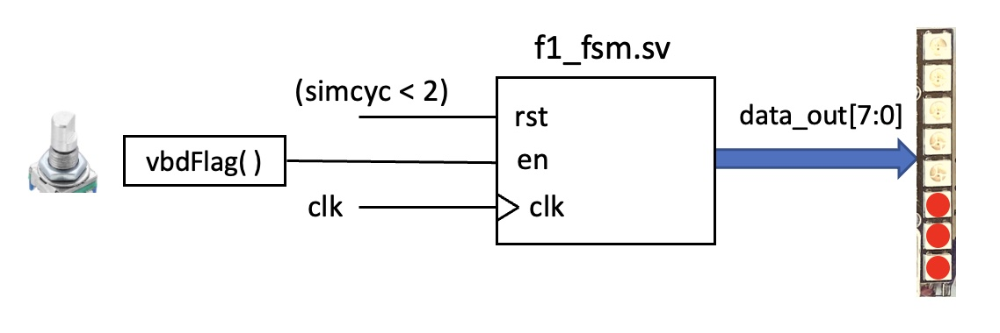
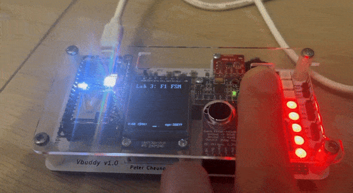

# Formula 1 Light Sequence

For this exercise, we are asked to build a finite state machine (FSM) that turns on the series of lights on Vbuddy in a sequence similar to that of F1 lights:



```SystemVerilog
module f1_fsm (
    input   logic       rst,
    input   logic       en,
    input   logic       clk,
    output  logic [7:0] data_out
);
    typedef enum {S0, S1, S2, S3, S4, S5, S6, S7, S8} light_state;
    light_state current_state, next_state;

    always_comb begin
        if (en)
            case (current_state)
                S0:     next_state = S1;
                S1:     next_state = S2;
                S2:     next_state = S3;
                S3:     next_state = S4;
                S4:     next_state = S5;
                S5:     next_state = S6;
                S6:     next_state = S7;
                S7:     next_state = S8;
                S8:     next_state = S0;
                default: next_state = S0;
            endcase
        else next_state = current_state;
    end

    always_ff @(posedge clk)
        if (rst) current_state <= S0;
        else     current_state <= next_state;

    always_comb
        case (current_state)
            S0:     data_out = 8'b0;
            S1:     data_out = 8'b1;
            S2:     data_out = 8'b11;
            S3:     data_out = 8'b111;
            S4:     data_out = 8'b1111;
            S5:     data_out = 8'b11111;
            S6:     data_out = 8'b111111;
            S7:     data_out = 8'b1111111;
            S8:     data_out = 8'b11111111;
        endcase
endmodule
```

This is a simple FSM that moves on to the next state when `en` is HIGH, else it stays in its current state. I notice that this could be implemented more cleverly with a for loop that iterates through the state enum list. However, the explicit declaration allows for clarity of the hardware design.

Similar to before, we are given a `verify.sh` script that runs a testbench `verify.cpp` on our module. Notably, the testbench employs the same GTest format, where it compares my module's output to the expected FSM transition groundtruth values:

```C++
TEST_F(TestDut, FSMTest)
{
    top->rst = 1;
    runSimulation();
    EXPECT_EQ(top->data_out, 0b0000);

    top->rst = 0;

    std::vector<int> expected = {
        0b0000'0000,
        0b0000'0001,
        0b0000'0011,
        0b0000'0111,
        0b0000'1111,
        0b0001'1111,
        0b0011'1111,
        0b0111'1111,
        0b1111'1111,
        0b0000'0000};

    for (int exp : expected)
    {
        EXPECT_EQ(top->data_out, exp);
        runSimulation();
    }
}
```

As with before, we manage to pass the provided tests:

```bash
[==========] Running 2 tests from 1 test suite.
[----------] Global test environment set-up.
[----------] 2 tests from TestDut
[ RUN      ] TestDut.InitialStateTest
[       OK ] TestDut.InitialStateTest (0 ms)
[ RUN      ] TestDut.FSMTest
[       OK ] TestDut.FSMTest (0 ms)
[----------] 2 tests from TestDut (0 ms total)

[----------] Global test environment tear-down
[==========] 2 tests from 1 test suite ran. (0 ms total)
[  PASSED  ] 2 tests.
```

In order to visualise the FSM we just built, we create a testbench `f1_fsm_tb.cpp` to interact with Vbuddy. To interact with the light bar on Vbuddy, we use the `vbdBar()` function. We cycle through each state by toggling `en` HIGH then LOW with the rotary switch button on one-shot mode (`vbdSetMode(1)`).

We also mask the data input into vbdBar with `0xFF` to ensure that `vbdBar()` correctly takes an unsigned 8-bit integer input between 0 and 255.

I zoomed in on the code block of interest, with my additional comments in `///`:

```C++
    // run simulation for many clock cycles
    for (i=0; i<1000000; i++) {

        // dump variables into VCD file and toggle clock
        for (clk=0; clk<2; clk++) {
            tfp->dump (2*i+clk);
            top->clk = !top->clk;
            top->eval ();
        }

        top->rst = (i < 2);
        vbdSetMode(1); /// one shot mode (on button press, toggles vbdFlag HIGH then back to LOW the next cycle)
        top->en = vbdFlag();
        
        // ++++ Send dout value to Vbuddy
        vbdBar(top->data_out & 0xFF); /// indicate which light to turn on using the FSM output
        vbdCycle(i);
        // ---- end of Vbuddy output section

        if ((Verilated::gotFinish()) || (vbdGetkey()=='q'))
            exit(0);
    }

    vbdClose();
    tfp->close();
    exit(0);
```

On compiling and running the code, we are able to see the lights turn on one by one with each press, before everything switches off at once:

