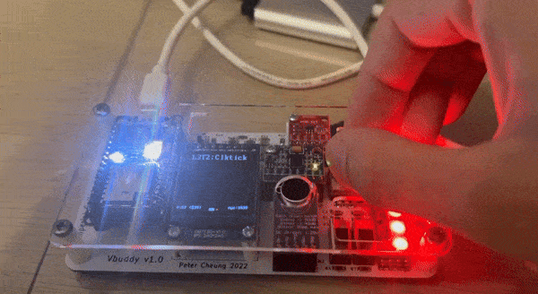
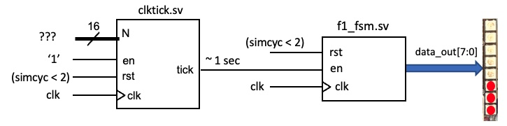
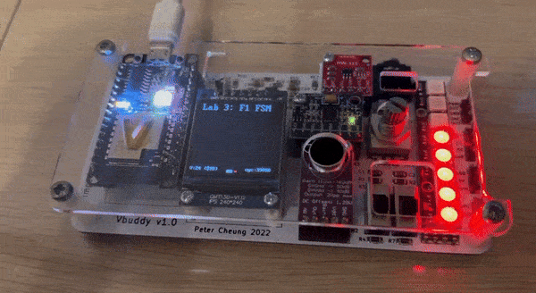

# Task 3: Exploring the clktick.sv and the delay.sv modules

In this task, we are given the `clktick.sv` module to generate a real-time clock output that counts in seconds from the `clk` input.

This is done by dividing the `clk` input by the input `N` + 1. As we know that the `clk` cycles faster than a second, we essentially wait a specified number of `clk` cycles (N - 1) for a second to expire, before returning a `tick` output pulse when it happens. This way, we can consistently create a `tick` pulse each second.

We are provided with the testbench `clktick_tb.cpp` and shell script `clktick.sh` to calibrate our N value, where we can use the rotary encoder to change the flash rate of the neopixels on Vbuddy until it matches with a tick period of 1 second.

We need to do this because each device runs at a different clock frequency. Hence, the need to adjust the N value across different computers:



After some trial and error, I find my optimal N value to be 24!

### Test Yourself Challenge

Now that we have our optimal N value, we are challenged to build a circuit that automatically cycles through the F1 light sequence with a 1 second delay per state transition:



We can now build a new "top-level" module called `f1_clktick.sv` to connect the `clktick.sv` module with the `f1_fsm.sv` module.

```SystemVerilog
module f1_clktick #(
        parameter   N_WIDTH = 16
)(
    input   logic                   clk,
    input   logic                   rst,
    input   logic                   en,
    input   logic [N_WIDTH-1:0]     N,
    output  logic [7:0]             dout
);

logic tick;

clktick #(N_WIDTH) CLKTICK (
    .clk (clk),
    .rst (rst),
    .en (en),
    .N (N),
    .tick(tick)

);

f1_fsm F1_FSM (
    .rst(rst),
    .en(tick),
    .clk (clk),
    .data_out (dout)
);

endmodule
```

Next, we create modify the testbench from task2 by removing the assignment of f1_fsm `en` to `vbdFlag()`. Note that the `tick` output from `clktick` performs the same "One-shot" effect on `en`, where it creates a single pulse when 1 second has elapsed. This will ensure that we only move by 1 state every 1 second.

We also initialize `top->N = 24` at the start of the file:

```C++
// initialize simulation inputs
top->N = 24;
top->clk = 1;
top->rst = 0;
top->en = 1;

// run simulation for many clock cycles
for (i=0; i<1000000; i++) {

    // dump variables into VCD file and toggle clock
    for (clk=0; clk<2; clk++) {
        tfp->dump (2*i+clk);
        top->clk = !top->clk;
        top->eval ();
    }

    top->rst = (i < 2);
    
    // ++++ Send dout value to Vbuddy
    vbdBar(top->dout & 0xFF);
    vbdCycle(i);
    // ---- end of Vbuddy output section

    if ((Verilated::gotFinish()) || (vbdGetkey()=='q'))
        exit(0);
}

vbdClose();
tfp->close();
exit(0);
```
Finally, we compile and run the program. However, we noticed that the counter was running quite fast. This could be down to the differences in the workload for the different testbenches that results in a faster simulated clock cycle for the actual f1 lights. After tweaking the N value, we eventually get a speed that is acceptable:


